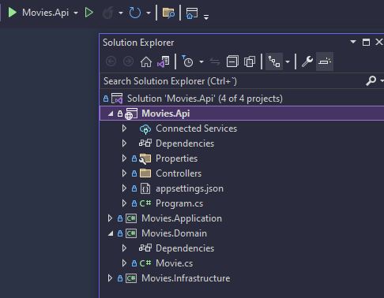
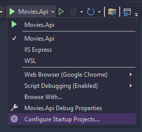
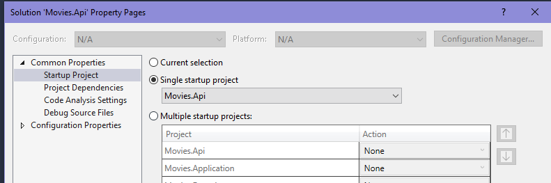
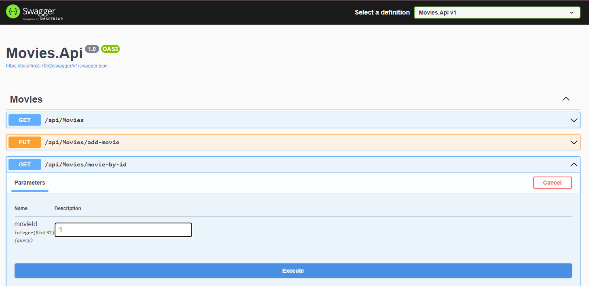

# CleanArchitectureExample

Tarea de realiza un ejemplo de clean architecture realizado con el framework de ASP.NET Core Web API.

Proyecto realizado con .NET 6 de long term support

Pasra ejecutarlo se debe clonar y a abrir con visual estudio, luego darle ejecutar con el sistema el proyecto llamada Movies.API.

El código se realizó siguiendo el tutorial: [Clean Architecture With ASP.NET Core WebAPI](https://www.c-sharpcorner.com/article/clean-architecture-with-asp-net-core-webapi/)

Para ejecutar el código se debe utilziar visual studio 2022 y abrir la solución llamada [Movies.Api.sln](./Movies.Api/Movies.Api.sln). Teniendo la solución abierta la ejecutamos con el botón de visual studio:

En caso de que Movies.Api no este como proyecto de ejecución se deba asignar dando click en confighurar proyecto de inicio:

Y seleccionar el que se llama Movies.Api:

Una vez ejecutado el proyecto se abrira una vetana de SwaggerUI la cual pemrite probar el Api de forma interactiva y facil:

En esta se pueden probar los tres métodos que ofrece el Api: Add-movie (permite agregar una película), Movies (devuelve todas las películas que hay) y movie-by-id (devuelve una película específica según el id).

Para los métodos que requieren de enviar parámetros como el add'movie y el movie-by-id SwaggerUi abre un forms donde se pueden ingresar los valores deseados.

Para probar cualquier método se debe seleccionar, dar click en "Try out", ingresar los parámetros si se requiere y luego darle a execute. El resultado se mostraá en formato json en una pestaña debajo del botón de execute.
